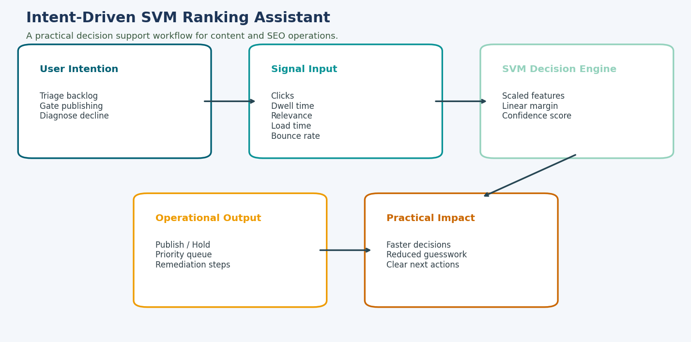

# Intent-Driven SVM Ranking Assistant

A practical desktop tool for SEO/content teams to train a linear SVM on real page data, score pages, and prioritize optimization work.



## What It Does

- Trains on real labeled data from CSV (`HIGH`/`LOW` or `1`/`0`)
- Supports configurable feature columns via `feature_config.json`
- Shows decision margin + confidence for single-page evaluation
- Displays model context: class balance, majority baseline, CV accuracy, and precision/recall by class
- Explains predictions using linear SVM feature contributions
- Includes **Batch Audit** mode for multi-page prioritization
- Tracks session history and exports it to CSV

## Files

- `main.py`: Full Tkinter app
- `feature_config.json`: Feature definitions and CSV column mapping

## Run Locally

```bash
python -m pip install numpy scikit-learn
python main.py
```

## Training CSV Format

Your training CSV must include:

- All feature columns from `feature_config.json`
- A label column (default: `label`)

Example columns (default config):

- `clicks`
- `dwell_time`
- `keyword_relevance`
- `load_time`
- `bounce_rate`
- `label`

Label values accepted:

- Positive: `HIGH`, `1`, `true`, `yes`
- Negative: `LOW`, `0`, `false`, `no`

## Batch CSV Format

Your batch CSV must include all configured feature columns.

Optional URL column:

- `page_url` by default (configurable via `url_column`)
- fallback accepted: `url` or `page`

Batch output includes:

- `page_url`
- `predicted_label`
- `confidence_score`
- `decision_margin`
- `top_contributing_signal`

Results are sorted by decision margin (lowest first) so weak pages rise to the top.

## Customizing Features

Edit `feature_config.json` to add/remove signals without changing code.

Each feature supports:

- `label`
- `key` (CSV + model input column)
- `min` / `max`
- `strict_min` (for values that must be strictly greater than `min`)
- `example` (prefill value in the UI)
